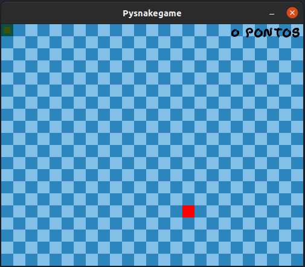

# PySnakeGame 🐍🎮
> A snake game written in Python using the Pygame library.  

[](https://github.com/psf/black)
[](https://www.python.org/downloads/release/python-390/)

<p align="center">
   
</p>

## :dart: Goal
The goal of this project was to explore the library pygame so that I could better understand its use and functioning<strike>, and have fun programming a game in python 😅 </strike>. 

## :construction_worker: Installing and Running
* Download the Python 3.9 or newer installer package from the official website and install it, if not installed previously.


* Run the following in the terminal to install the Pygame library  
```shell
pip install pygame
```

* Download the source code from the repository and run the file just as any other Python script (.py) file.
```python
python pysnakegame\game.py
```

## Prerequisites
* [Python](https://www.python.org)
* [Pygame](https://www.pygame.org/wiki/GettingStarted) - An open source Python library for making multimedia applications

## Authors

* **Wellington Lorenço de Souza**

See also the list of [contributors](https://github.com/wlsouza/pysnakegame/graphs/contributors) who participated in this project.

## Acknowledgements
* [Pygame Documentations](https://www.pygame.org/docs/)
